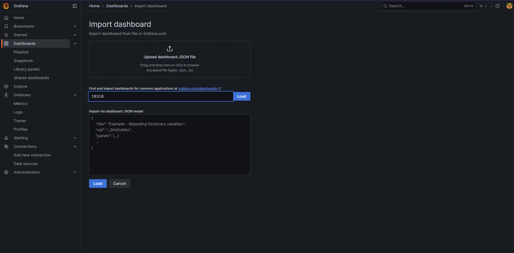

# ha_postgres

Run a highly available Postgres cluster using docker containers as nodes for Postgres servers. Additionally continous backups can be set up with Barman running as a separate container(remote node). You can also add visualizations(?) to your cluster with Grafana dashboards.

```
export ARCHIVE_DIR=/path/for/archiving
sudo chown -R 991:991 $ARCHIVE_DIR
export BACKUP_DIR=/path/to/backup/data  # ARCHIVE_DIR and BACKUP_DIR should be separate directories
sudo chown -R 991:991 $BACKUP_DIR

./run_pg.sh <node number> <port>  e.g nohup ./run_pg.sh 1 5432 > /tmp/test.1 &, nohup ./run_pg.sh 2 5433 > /tmp/test.2 &, nohup ./run_pg.sh 3 5434 > /tmp/test.3 &

# Create roles to be used by barman and the stats exporter
docker exec testPG.1 bash -c "/usr/local/pgsql/bin/psql -U patroni_super -d postgres -c \"CREATE USER streaming_barman WITH REPLICATION ENCRYPTED PASSWORD 'streaming_barman'; CREATE USER barman WITH SUPERUSER ENCRYPTED PASSWORD 'barman'; CREATE USER prom_pg_exporter WITH SUPERUSER ENCRYPTED PASSWORD 'prom_pg_exporter';\""

./barman.sh
./grafana.sh
```

After every script has ran to completion, check the browser on http://localhost:3000 to access Grafana and login using default username and password `admin` for both.

Once logged in create a data source 

Point it to Prometheus 

Set listening address  

Save the changes  Create a new dashboard by clicking on the `building a new dashboard` link on the success screen or `Dashboards` tab on the navigation bar.

Click to `import a dashboard` of your choice. Select `discard` in the pop up that follows. You can choose from the many available ones in [grafana store](https://grafana.com/grafana/dashboards/). 


Copy the ID of the dashboard you prefer and paste it here. This example uses `PG Overview` dashboard with ID `18316`. 

Load it up! Import the dashboard 

It should be loaded and showing all the metrics collected by the exporter from the configured Postgres instance(node). 